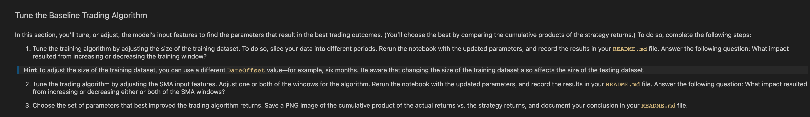

# machine_learning_trading_bot_project_two

## Tools
Code is written using Python version Mac 3.10.4 and runs in a Jupyter Lab notebook. 
The following libraries are required to run this program:

- [Datetime](https://docs.python.org/3/library/datetime.html) supplies classes for manipulating dates and times.
```python
import datetime as dt
```
- The [OS](https://docs.python.org/3/library/os.html) module is used to interact with the computer's operating system.
```python
import os
```
- [Pandas](https://pandas.pydata.org/docs/) is a fast, powerful, flexible and easy to use open source data analysis and manipulation tool, built on top of the Python programming language.
```python
import pandas as pd
```
- [Requests](https://docs.python-requests.org/en/master/) Requests is an elegant and simple HTTP library for Python, built for human beings.
```python
import requests
```
- [Yahoo Finance](https://pypi.org/project/yfinance/) API is a modern platform for algorithmic trading data.
```python
import yfinance as yf
```

---
## Inatallation Guide

### Create a new conda environment to avoid conflicts with other package installations:
```powershell
conda deactivate
```
```powershell
conda update conda
```
```powershell
conda create -n pyviz python=3.10.4 anaconda
```
```powershell
conda activate pyviz
```
### Install PyViz packages:
```powershell
conda install -c plotly plotly=4.13.
```
```powershell
conda install -c pyviz hvplot
```
- PyViz require NodeJS version >= 12
```powershell
conda install -c conda-forge nodejs=12
```
### Install required JupyterLab Dependencies:
```powershell
conda install -c conda-forge jupyterlab=2
```
```powershell
jupyter labextension install jupyterlab-plotly@4.13.0 --no-build
```
```powershell
jupyter labextension install @jupyter-widgets/jupyterlab-manager plotlywidget@4.13.0 --no-build
```
```powershell
jupyter labextension install @pyviz/jupyterlab_pyviz --no-build
```
```powershell
jupyter lab build
```
### Install python-dotenv
```powershell
pip install python-dotenv
```
---
## Project Documents
[Project Charter](https://docs.google.com/document/d/1nP-jz_CLV25-TVeKC_yvcnKNwsJ0CRHnc7tTFyKvSEk/edit?usp=sharing) is a link to a Google document.
[Project Presentation](https://docs.google.com/presentation/d/1DXBFapzd6YBwvNoU32vt_G8ZFDDlZIQuLoMcb_Fc0sI/edit?usp=sharing) is a link to a Google presentation. 

---
## Executive Summary


---
## Instructions
Use the starter code file to complete the steps that the instructions outline. The steps for this Challenge are divided into the following sections:

* Establish a Baseline Performance

* Tune the Baseline Trading Algorithm

* Evaluate a New Machine Learning Classifier

* Create an Evaluation Report

### Part 1: Establish a Baseline Performance


### Part 2: Tune the Baseline Trading Algorithm


### Part 3: Create an Evaluation Report


---
## Contributors
Initial Commit Ava Cazares. Open Source

---
## License
None.

# Machine Learning Trading Bot - Report

## Analysis of the Actual Returns vs. SVC Model Returns

### Short 4, Long 100, DateOffset 3 months

SVM's SVC classifier was the initial machine learning algorithm that was evaluated. It was created using the following key parameters to determine both the algorithm and that training data:

```python
short_window = 4
long_window = 100
DateOffset = 3 months
```

The overall accuracy score of this SVC model with these parameters was 0.55.

Based on the comparison of cumulative returns between the actual returns of the ETF and the returns using the SVC model predictions, predictions using the SVC model returned a slight out-performance (SVC 1.52 vs actual 1.386)


---

## Analysis of Actual Returns vs. Tuned ML Bot Returns


### Step 1: Short 4, Long 100, DateOffset 24 months

For the first alteration, the short and long window periods were kept at their original values of 4 and 100, respectively, and the training period adusted to 24 months.

```python
short_window = 4
long_window = 100
DateOffset = 24 months
```

The cumulative returns that resulted from chaning the periods associated with the training and testing data can be seen in the following image. 


By changing the training window, both the model accuracy score, and the cumlative performace of the strategy did improve. The accuracy score was reported at 0.56 and the cumulative preformace at 1.634%. 

Overall, increasing the training window imporved the performance of the model.  


### Step 2: Short 50, Long 200, DateOffset 3 Months

For this version up updating the SVM machine learning model, the short window was adjusted to 50 periods, and the long window to 200 periods. The DateOffset parameter stayed the same at 3 months.

```python
short_window = 50
long_window = 200
DateOffset = 3 months
```

An image of the cumulative retrun data for this version of the model is seen below:


The accuracy score of the SVC model using the above parameters was roughly in-line with the previous models 0.54.

In terms of cumulative performance, the SVM strategy actually underperformed using these parameters, returning only 1.437 versus the actual return value of 1.565.

Three months was clearly not enough time to train the SVC model with a short window of 50 periods and a long window of 200.

### Step 3: Short 50, Long 200, DateOffset 24 Months

It is interesting to note that if the DateOffset period was adjusted to 24 month in order to accomodate the longer short and long window periods, the performance does improve drastically. 

```python
short_window = 50
long_window = 200
DateOffset = 24 months
```

As seen in the following image, the model actually returns 1.83% versus actual returns of 1.398%. 


Not surprisingly, the longer windows allows for better pattern recognition with regard to the behavior of the ETF over time, and the longer training period gives the model additional opportunity to learn based on the data. 

---

## Analysis of Actual Returns vs. AdaBoost Returns

The original parameters, as seen below, were evaluated using the AdaBoost Classifier model.

```python
short_window = 4
long_window = 100
DateOffset = 3 months
```

The overall accuracy of the AdaBoost classifier model was in line with the SVC's at 0.55

The AdaBoost Classifier returned an on overall performance of 1.571 as seen in the following image. 


Overall, the AdaBoost classifier model outperformed the baseline SVC model, returning 1.57 versus 1.52.

It appears that the AdaBoost classifier model is better at predicting the signals for the short-long algorithm with the original parameters than was the SVC model.

---

## Conclusions

Overall, it appears that the AdaBoost classifier is a better fit for the long-short algorithm trading strategy presented in this Challenge (1.57 vs 1.52).  

However, given the performance data that was returned by fine-tuning the parameters for the SVC model, it would be beneficial to evaluate the AdaBoost classifier under those same conditions to confirm.
